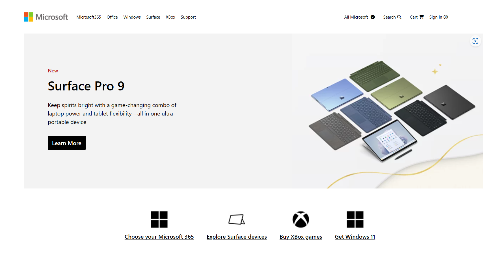

# Microsoft Clone

This is a clone of Microsoft's official website made using just HTML and Tailwind CSS.

## Preview Images

Click the image below to view a video preview of the website. 

## Tech Stack

* HTML
* Tailwind CSS

## Getting Started

To rebuild the website on your local system, follow these steps:

1. Fork this repo.
2. Clone your forked repo to your local system.
3. Run `npm install` to install the dependencies.
4. Run `npm run start` to make the site live.

That's it! You can now access the website by opening your web browser and navigating to `http://127.0.0.1:5173/`.

## Contributing

If you want to contribute to this project, feel free to submit a pull request. All contributions are welcome!

## Purpose

This project is made just for learning & practicing concepts by me.
